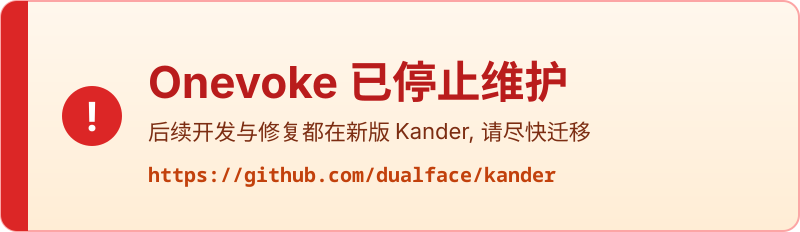

# Onevoke

[](https://github.com/dualface/kander)

> ## ⚠️ 本项目已停止维护
>
> **Onevoke 的后继版本是 [Kander](https://github.com/dualface/kander)**, 用 Go 重写, 修复了大量问题并补上了终端看板、审核门禁与跨平台支持.
>
> 本仓库不再接受新功能和 Bug 修复, 仅作存档. 请迁移到 **<https://github.com/dualface/kander>**.

一个人用看板调度多个 AI Agent.


## 1. 新手指引

安装完成后即可使用.

4 步上手:

1. 新建一个 Agent 会话, 在里面讨论需求或者任务, 说清楚目标和验收条件. 推荐使用 Agent 的 Plan 模式.
2. 任务确认后, 在该会话里要求 Agent 用看板流程完成任务:

```text
用 kanban new & start 创建任务卡并启动
```

3. 有多个需求时, 对每个需求重复步骤 1-2, 不断安排并启动任务.
4. 用命令行界面查看任务状态:

```sh
kanban tui
```

## 2. 安装

需要 Python 3, Git, 以及 Codex, Claude, Grok 或 Cursor 中至少一个.

Onevoke 有两种安装作用域, 共用同一套规则和程序.

### 2.1 全局安装

macOS/Linux:

```sh
./install.sh
```

Windows (PowerShell):

```powershell
.\install.ps1
```

安装完成后会显示配置菜单, 根据需要配置各个角色要使用的 Agent 和模型.

### 2.2 项目本地安装

macOS/Linux:

```sh
./install.sh --project <项目目录>
```

Windows (PowerShell):

```powershell
.\install.ps1 --project <项目目录>
```

## 3. 常用命令

`kanban tui` 用命令行界面查看任务状态. 支持多栏浏览、搜索、任务详情、鼠标操作与剪贴板复制.


也可以启动 Web 看板, 在浏览器中查看:

`kanban web` 默认在 `http://127.0.0.1:8080` 启动.

看板总览:


点击卡片可查看任务详情:


## 4. 工作流程

每个任务都按下面的流程进行:

### 4.1 任务拆分

Agent 会根据任务的复杂度和可拆分情况, 将任务拆分为尽可能独立的任务卡. 每个任务卡对应一个或多个 Markdown 文件.

如果一个任务拆分为多个任务卡, 则视为一个任务卡组.

### 4.2 单个任务卡独立完成

对于单个任务卡, 会启动一个独立的 Agent 完成任务. 这个 Agent 称为任务 Agent.

任务 Agent 的工作步骤:

- 创建一个 git worktree, 避免和其他 Agent 的工作互相干扰.
- 生成代码或文档.
- 启动独立的审核 Agent 对成果进行审核.
- 审核通过后, 将 worktree 合回到 develop 分支.
- 输出任务总结, 结束.

### 4.3 多个任务卡组成的任务卡组

启动任务卡组的 Agent 会转变为主控 Agent, 并负责编排任务和审核流程.

主控 Agent 会根据任务卡的依赖关系, 确保所有任务卡按照正确的顺序完成. 在可能的情况下, 也会同时启动多个任务卡, 提高效率.

与单个任务卡的流程有所区别, 每个任务 Agent 现在只负责生成代码或文档.

- 当整个任务卡组完成代码或文档的生成后, 主控 Agent 会启动审核流程.
- 收到审核 Agent 返回的结果, 主控 Agent 负责对汇总, 再将修改意见发给适当的任务 Agent.
- 重复整个过程, 直到整个任务卡组完成. 最后合回 develop 分支.
- 输出任务总结, 结束.

### 4.4 审核

Onevoke 中定义了四种审核角色, 每个角色在审核时侧重点不同:

- PM: 产品经理只关注功能实现是否符合目标, 不会随意扩大功能范围.
- QA: 关注功能实现是否符合项目整体架构要求, 以及代码质量和可维护性.
- CSA: 关注代码内在安全性.
- Hacker: 用对抗性视角从外部审查是否存在攻击弱点.

用户可以配置四种审核角色是否启用. 大多数任务启用 PM 和 QA 就足够了.

## 5. 配置

使用命令 `onevoke welcome --reset` 可以随时修改配置:

- 选择执行任务卡的 Agent
- 选择四种审核角色使用的 Agent
- 启用哪些审核角色
- 默认语言等

## 6. 许可

本项目使用 MIT License, 见 [LICENSE](LICENSE).
